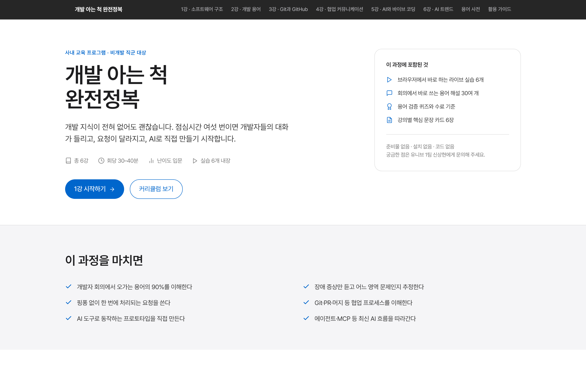
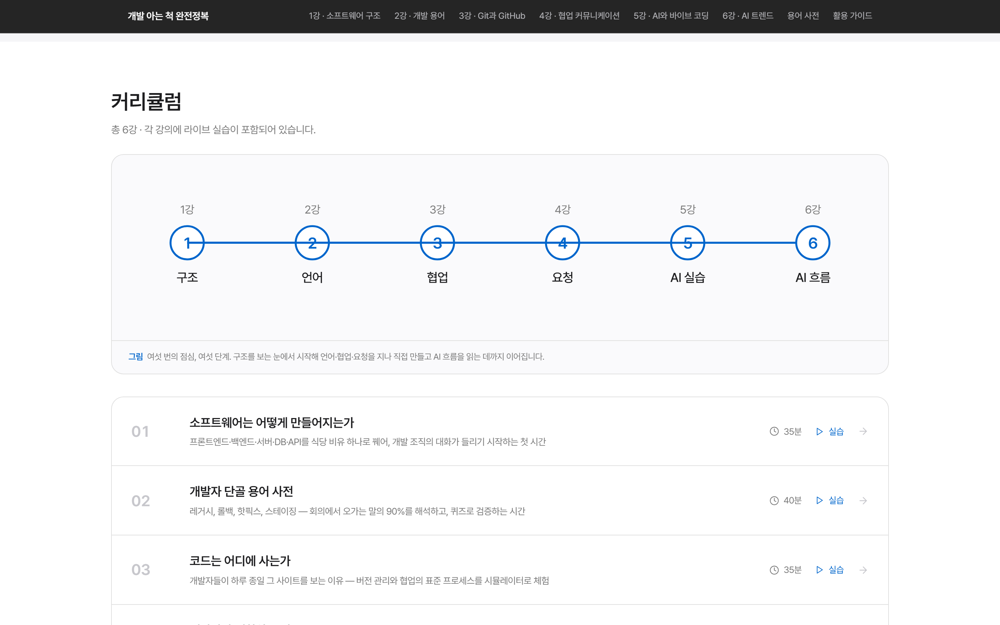
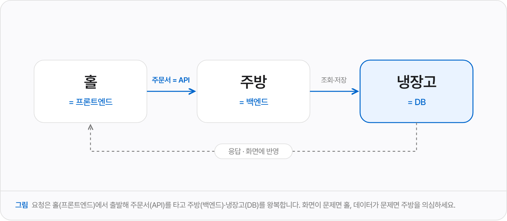
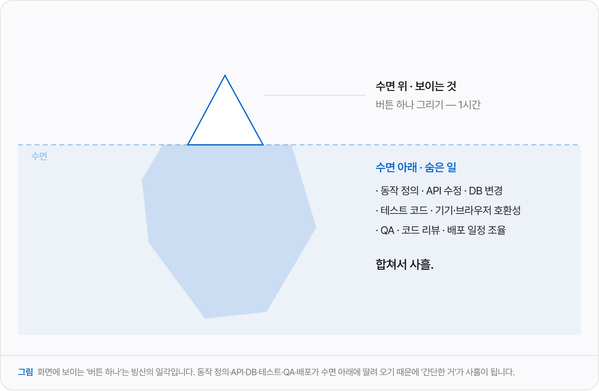
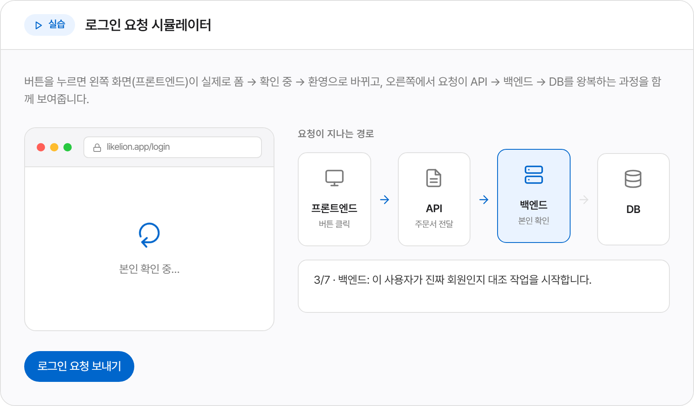
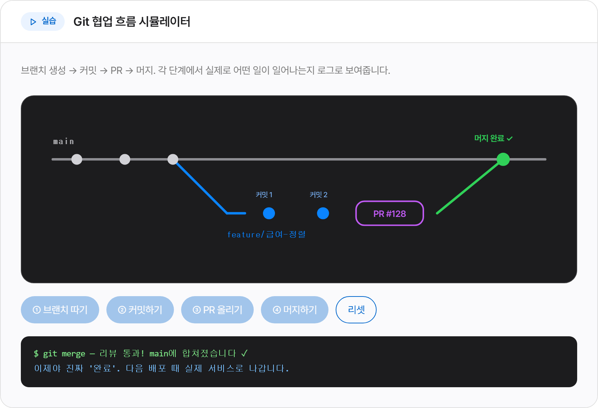
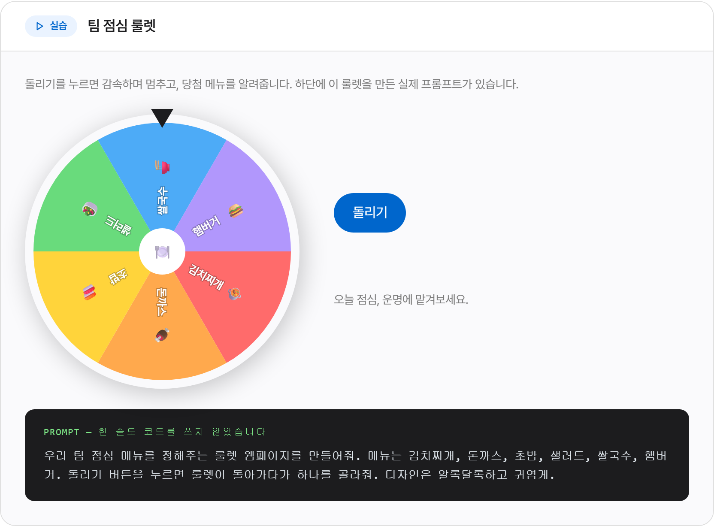
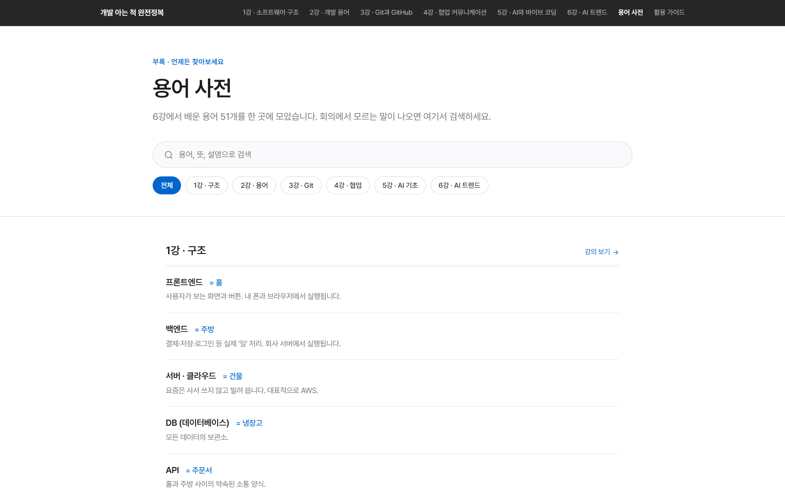
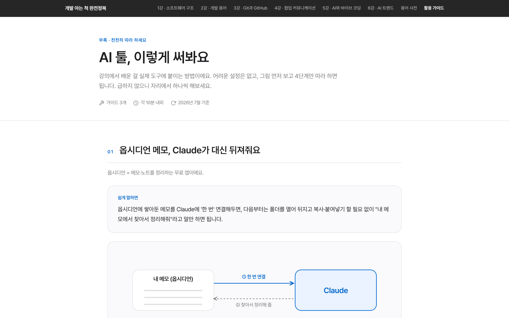

# 개발 아는 척 완전정복

> 비개발 직군(기획·운영·마케팅·디자인)을 위한 **점심시간 사내 교육 6회차** 웹사이트



개발 지식이 전혀 없어도 괜찮습니다. 점심시간 여섯 번이면 개발자들의 대화가 들리고, 요청이 달라지고, AI로 직접 만들기 시작합니다.

모든 개념을 **식당 비유**(홀=프론트엔드, 주방=백엔드, 냉장고=DB, 주문서=API)로 설명하고,
설치나 계정 없이 **브라우저에서 바로 동작하는 실습**을 각 강의에 담았습니다.

React + TypeScript + Tailwind CSS v4 + Vite로 만들었고, 디자인은 Apple 웹 디자인 시스템을 참고했습니다.

---

## 이런 사이트예요

### 1. 6주 커리큘럼

한 눈에 들어오는 여정 로드맵과 회차별 목록.



### 2. 개념 도식 — 말 대신 그림으로

추상적인 개발 개념을 전부 그림으로 풀었습니다. 전 회차에 걸쳐 **14종의 SVG 도식**이 들어 있습니다.





### 3. 라이브 실습 — 클릭하면 움직입니다

발표자가 클릭하면 다 같이 구경하는 방식이라, 밥 먹으면서 듣는 강의에 딱 맞습니다.

**로그인 요청이 시스템을 왕복하는 1초** (1강)



**브랜치 → 커밋 → PR → 머지** (3강)



**프롬프트 한 줄로 만든 실제 결과물** (5강)



### 4. 용어 사전 — 수업이 끝난 뒤에도

6강에 흩어진 용어 51개를 한 페이지에 모았습니다. 검색과 회차별 필터 지원.



### 5. AI 툴 활용 가이드

강의에서 배운 걸 실제 도구에 붙이는 방법. 그림 먼저 보고 4단계만 따라 하면 됩니다.



---

## 구성

| 회차 | 강의안 | 라이브 데모 |
|---|---|---|
| 1. 소프트웨어 구조 | 식당 비유 대응표 · 외부 연동 생태계 | 로그인 요청 왕복 여정 시뮬레이터 |
| 2. 개발 용어 | 용어 플립 카드 8종 · 배포 파이프라인 | 용어 퀴즈 (6문제) |
| 3. Git & GitHub | 타임머신/감사기록/동시편집 | 브랜치→커밋→PR→머지 시뮬레이터 |
| 4. 협업 커뮤니케이션 | 버튼 하나의 빙산 · 요청 3요소 | 좋은 요청 빌더 (핑퐁 미터) |
| 5. AI와 바이브 코딩 | LLM의 정체 · 다음 단어 예측 | 점심 룰렛 (폭죽 포함) |
| 6. AI 트렌드 | 하네스/컨텍스트/MCP · AI 툴 카탈로그 | 챗봇 vs 에이전트 비교 데모 |

**부록**

| 페이지 | 내용 |
|---|---|
| 용어 사전 (`/glossary`) | 전 회차 용어 51개 · 검색 + 회차 필터 |
| 활용 가이드 (`/guides`) | 옵시디언+Claude, Claude 커넥터, 매니패스트 |

---

## 로컬 실행

```bash
npm install
npm run dev        # http://localhost:5173
```

빌드 결과 미리보기: `dist/index.html`을 그대로 브라우저로 열어도 동작합니다 (`base: "./"`).

```bash
npm run build      # tsc -b && vite build
npm run preview    # http://localhost:4173
```

## 배포 (Vercel)

**방법 1 — CLI**
```bash
npm i -g vercel
vercel            # 로그인 후 엔터 몇 번. 프레임워크: Vite 자동 감지
vercel --prod     # 프로덕션 배포
```

**방법 2 — GitHub 연동**
1. 이 폴더를 GitHub 저장소로 푸시
2. vercel.com → Add New Project → 저장소 선택
3. Framework Preset: Vite (자동 감지) → Deploy

빌드 설정은 자동 감지됩니다 (Build: `npm run build`, Output: `dist`).
라우팅은 **HashRouter**라 Vercel rewrite 설정이 필요 없습니다.

---

## 스크린샷 갱신

`docs/screenshots/`의 이미지는 Playwright로 자동 촬영했습니다. 화면이 바뀌면 다시 찍어 교체하세요.

문의: 유니브 1팀 신상현
